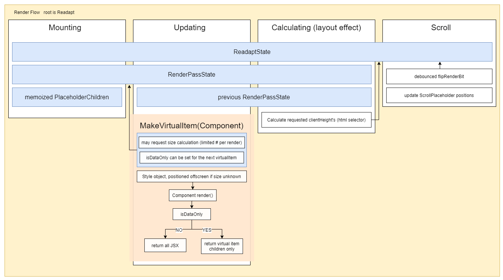

# Readapt
Currently under development, not production ready. All based on a single prototype iteration right now.

A highly flexible React virtualization library for every situation. "Adapt. React. Readapt. Apt."

TL;DR [How do I use it?](#enough-how-do-i-use-it)

# What can it do?

Readapt can virtualize everything, in various combinations:

* tree of nested or recursive components.
* flat list.
* dynamically sized items.
* some dynamic some static.
* some dynamic items will have the same size. (categorySize)
* placeholders while scrolling.
* individual items changing size based on events or state changes.
* components internal state can be retained. (deoptimization option, forced with trees)

Readapt handles it all. It also provides a matrix of optimizations and deoptimizations to handle extra situations.

The fastest thing will always be a single flat list with static consistently sized items, but that's not always achievable, and virtualization can still go a long way to obtaining your performance goals.

# How does it do it?!

Readapt has its own lifecycle. Which uses a combination of high-level state, a state for each render pass that can compare the past render to the currently active one. A given render pass state is provided via context to all virtual item components you create (higher order component), and can be manipulated through the RenderPass api.

Readapt then provides your components a prop that they'll use to early return, avoiding making any DOM during specific renders, instead they'll render any virtual items that are children (tree list) or, simply return null if it doesn't have any. Other props are provided to allow the component to invalidate its dynamic size, so any props that would change the size are able to be calculated even if the component doesn't have any DOM (is off the screen). The final thing provided is a style object that uses transform to position the component relative to everything that came before it (they might not be in the dom!).



# ENOUGH! How do I use it?

First, wrap your existing root items with Readapt, refer to the `API Docs` (TODO) for more options.

```js
<Readapt>
  {items.map((item) => (
    <MyVirtualComponent {...item} />
  ))}
</Readapt>;
```

Then use the higher order component to make your virtual components.. virtual. Make sure to return before you make any DOM if `isDataOnly` is true, and use the style provided.
You'll also note there is a second function required, it too receives the props, but returns `id` and `size`, id is required, size is only required if this particular component is statically sized. See more at the `Component API` (TODO)

```js
const MyVirtualComponent = makeVirtualComponent((props) => {
    if (props.readapt.isDataOnly) return null;

    return <div style={props.readapt.style}>...</div>
}, (props) => ({ id: props.id, size: 10 });
```

Working examples and a playground are coming soon!
